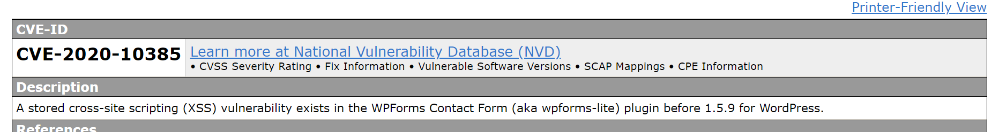

# ForensicsTask1
FORENSIC 
=
---
1. Khái niệm :

   Trong lĩnh vực an toàn thông tin, Computer Forensics hay còn gọi là điều tra số là công việc phát hiện, bảo vệ và phân tích thông tin được lưu trữ, truyền tải hoặc được tạo ra bởi một máy tính hoặc mạng máy tính, nhằm đưa ra các suy luận hợp lý để tìm nguyên nhân, giải thích các hiện tượng trong quá trình điều tra.
2. Một số dạng challenge:

1. Image file format analysis
    2. Network Forensics
    3. Network Forensics
    4. Sound File
    5. Memory Forensics
---
## Các công cụ phổ biến cho từng mảng và các thông tin liên quan khác về các mảng sau: ##
1. Forensics tổng quan:
    
    1. File forensics
   2. Image forensics
   3. Network forensics
   4. Memory 
   5. Tools: split, pdfinfo, pdfimages, pdfcrack, pdfdetach, Keepass, Magic Numbers, hexed.it, foremost, binwalk, Repair image online tool, photorec, TestDisk, pngcheck, pngcsum, Registry Dumper, Dnscat2, pefile, Wireshark, Network Miner, PCAPNG, tcpflow, PcapXray, qpdf, Audacity, sonic visualiser, ffmpeg strings, file, grep, scalpel, bgrep, hexdump, xxd, base64, xplico framework, zsteg, gimp, Memory dump - volatility, ethscan, and many more.

Những trường hợp cần forensics:
+ Khi hệ thống bị tấn công chưa xác định được nguyên nhân
+ Khi cần khôi phục dữ liệu thiết bị, hệ thống
+ Hiểu rõ cách làm việc của hệ thống
+ Điều tra tội phạm liên quan đến công nghệ cao
+ Điều tra hoạt động của tổ chức
+ Điều tra các hoạt động gián điệp trong công nghệ
---
2. File Forensics (File Formats)
+ Tools: binwalk.
---
3. Steganography

   + Steganography là nghệ thuật viết ẩn hoặc che giấu. Mục đích của steganography là liên lạc bí mật để che giấu một tin nhắn từ bên thứ ba. Điều này khác với cryptography, nghệ thuật viết bí mật, nhằm mục đích làm cho bên thứ ba không thể đọc được thông điệp nhưng không che giấu sự tồn tại của thông tin liên lạc bí mật.

   + Steganography che giấu thông điệp bí mật nhưng không che giấu thực tế là hai bên đang liên lạc với nhau. Quá trình steganography thường liên quan đến việc đặt một tin nhắn ẩn trong một số phương tiện truyền tải, được gọi là carrier. Thông điệp bí mật được nhúng trong carrier để tạo thành phương tiện lưu trữ. Việc sử dụng khóa ghi mật mã có thể được sử dụng để mã hóa thông điệp ẩn và/hoặc để ngẫu nhiên hóa trong lược đồ ẩn mật.
   + Tóm tắt: steganography_medium = hidden_message + carrier + steganography_key

Các loại steganography:
+ Technical steganography: dùng phương pháp khoa học để che giấu tin nhắn
+ Linguistic steganography: ẩn tin nhắn trong carrier 1 cách không rõ ràng và được phân loại thành semagrams hoặc open codes.
+ Semagrams ẩn thông tin bằng cách sử dụng kí hiệu hoặc dấu hiệu. Một semagram trực quan sử dụng các đối tượng vật chất hàng ngày hoặc trông có vẻ ngây thơ để truyền tải một thông điệp, chẳng hạn như hình vẽ nguệch ngoạc hoặc vị trí của các mục trên bàn hoặc Trang web. Một semagram văn bản ẩn một thông báo bằng cách sửa đổi hình thức của văn bản mang, chẳng hạn như những thay đổi nhỏ về cỡ chữ hoặc kiểu chữ, thêm khoảng trắng thừa hoặc các nét hoa khác nhau trong các chữ cái hoặc văn bản viết tay.
+ Open codes ẩn một tin nhắn trong một tin nhắn của nhà cung cấp dịch vụ hợp pháp theo những cách mà người quan sát không nghi ngờ sẽ không thấy rõ. Thông báo của nhà cung cấp dịch vụ đôi khi được gọi là giao tiếp công khai trong khi thông báo ẩn là giao tiếp bí mật. Danh mục này được chia thành các jargon codes and covered ciphers.
+ Jargon codes sử dụng ngôn ngữ được một nhóm người hiểu nhưng vô nghĩa đối với những người khác.
+ Covered or concealment ciphers ẩn một tin nhắn một cách công khai trong phương tiện vận chuyển để bất kỳ ai biết bí mật về cách thức nó được che giấu đều có thể phục hồi nó.

Steganography Tools:
+ WetStone Technologies’ Gargoyle (formerly StegoDetect) software can be used to detect the presence of steganography software.
+ AccessData’s Forensic Toolkit and Guidance Software’s EnCase can use the HashKeeper, Maresware, and National Software Reference Library (National Software Reference Library 2003) hash sets to look for a large variety of software.
+ Niels Provos’ stegdetect can find hidden information in JPEG images using such steganography schemes as F5, Invisible Secrets, JPHide, and JSteg.
---
4. Network Forensics
+  Network Forensics là việc chặn bắt, ghi âm và phân tích các sự kiện mạng để khám phá nguồn gốc của các cuộc tấn công hoặc sự cố của một vấn đề nào đó.
+ Tools: WireShark.
---
5. Memory Forensics
+ Là kỹ thuật điều tra máy tính bằng việc ghi lại bộ nhớ RAM của hệ thống thời điểm có dấu hiệu nghi ngờ, hoặc đang bị tấn công để tiến hành điều tra, giúp cho việc xác định nguyên nhân cũng như các hành vi đã xảy ra trên hệ thống, cung cấp các chứng cứ phục vụ cho việc xử lý tội phạm.
+ Kỹ thuật điều tra này được sử dụng khi quá trình phân tích tĩnh từ những gói tin thu được, cũng như các thông tin từ nhật ký hệ thống ghi lại, nhưng chưa xác định được nguồn gốc cũng như kỹ thuật tấn công, hoặc cung cấp các thông tin có được chưa đầy đủ, chưa đủ sức thuyết phục.
+ Tools: Volatility, Mandiant Redline.
---
6. Disk Forensics
+ Điều tra phương tiện lưu trữ (Disk Forensics) là việc thu thập, phân tích dữ liệu được lưu trữ trên phương tiện lưu trữ vật lý, nhằm trích xuất dữ liệu ẩn, khôi phục các tập tin bị xóa, qua đó xác định người đã tạo ra những thay đổi dữ liệu trên thiết bị được phân tích.
+ Tools: Autopsy/the Sleuth Kit
